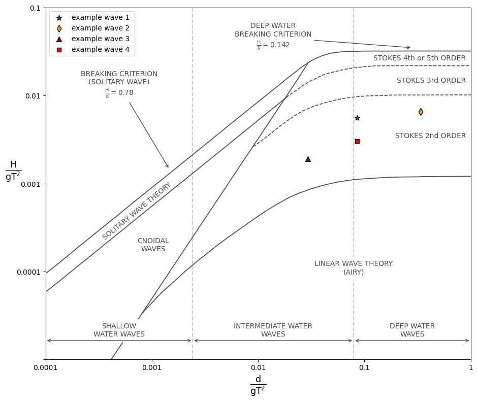

# le-mehaute-diagram

## Description 

This script is designed to give validity to a defined periodic wave according to the theories suggested by Le Méhauté (1976).
The limits of the different theories where extracted with help of an image digitizer (https://automeris.io/WebPlotDigitizer/) and saved to an numpy file, which is read by the script.


## Basic usage

The script takes wave period, wave height and water depth as an input to describe waves inside the Le Méhauté diagram as follows:

```python
Example = LeMehauteDiagram()
Example.add_wave(H=0.11, d=1.682, T=1.42, label="example wave 1") 
Example.show()
```
An example function is added to the script which produces the following plot:



 
